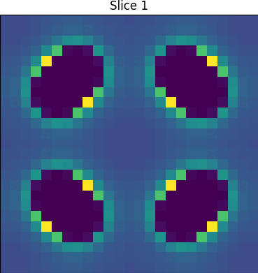

  

MOXελ is a Python package for **parallel calculation of energy voxels**, with
emphasis on reticular chemistry.

  

## :gear: Installation
Package will be soon released in PyPi.

## :book: Usage
Documentaiton will be soon available. 
