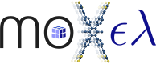

.. Moxel documentation master file, created by
   sphinx-quickstart on Fri Aug 11 13:30:19 2023.
   You can adapt this file completely to your liking, but it should at least
   contain the root `toctree` directive.

.. _introduction:

Introduction
============

MOXελ is a Python package to ease and accelerate through **parallelization**, the
**calculation of** voxelized potential energy surfaces, or simply **energy voxels**,
with emphasis on reticular chemistry.

These energy voxels can then be used as a raw input for Machine Learning (ML)
algorithms or for manual feature extraction.

.. _advantages:

Why ΜΟΧελ?
----------

First of all, why energy voxels?

    *Interactions are the quintessence of chemistry*, completely characterizing
    the behavior (properties) of a material. The *potential energy surface
    (PES)* succinctly describes these interactions and as such, it is the most
    informative input that can be fed into a ML algorithm. Since the PES is a
    continuous function, *voxelization is necessary to convert the PES into a
    machine understandable format*.

Remember, *there is no free lunch*! Getting the most informative input is
computationally expensive. Fortunately, since **all calculations in MOXελ are
parallelized**, the **computational cost is significantly decreased**.

**All you need is a** ``.cif`` **!**

Objective
---------

The majority of time in a ML workflow goes into constructing the inputs and
making sure they are clean, rather than focusing on the ML part itself.

MOXελ aims to provide a **simple and fast interface to generate energy voxels in
a ML-ready format**, minimizing as much as possible the time spent on these
preprocessing steps.

Please note that MOXελ focuses only on energy voxels. If you want to fill the
voxels with other values or employ a different featurization scheme, check
`mofdscribe <https://mofdscribe.readthedocs.io/en/latest/index.html>`_.

Citing MOXελ
------------

If you use ΜΟΧελ in your research, please consider citing the following work::
    
    @article{Sarikas2024,
    title = {Gas adsorption meets deep learning: voxelizing the potential energy surface of metal-organic frameworks},
    volume = {14},
    ISSN = {2045-2322},
    url = {http://dx.doi.org/10.1038/s41598-023-50309-8},
    DOI = {10.1038/s41598-023-50309-8},
    number = {1},
    journal = {Scientific Reports},
    publisher = {Springer Science and Business Media LLC},
    author = {Sarikas,  Antonios P. and Gkagkas,  Konstantinos and Froudakis,  George E.},
    year = {2024},
    month = jan 
    }

TODO
----

1. Improve performance
2. Improve voxelization scheme
3. Improve modeling of interactions

License
-------
MOXελ is released under the `GNU General Public License v3.0 only <https://spdx.org/licenses/GPL-3.0-only.html>`_.

.. toctree::
   :maxdepth: 1
   :caption: Contents:

   installation
   tutorial
   moxel
   changes

Indices and tables
------------------

* :ref:`genindex`
* :ref:`modindex`
* :ref:`search`
