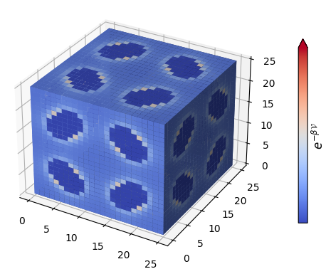

.. highlight:: python

|:rocket:| Tutorial
===================

As stated in :ref:`advantages`, all you need is a ``.cif`` file!

If you don't have one |:point_right:| :download:`IRMOF-1.cif<down/IRMOF-1.cif>`.

Note that in the following examples, ``path/to/`` can be an absolute or relative pathname.

Calculation and visualization of voxels
---------------------------------------

Calculation
^^^^^^^^^^^

1. Functional interface:

    .. code-block::

        >>> from moxel.utils import voxels_from_file
        >>> voxels = voxels_from_file('path/to/IRMOF-1.cif', grid_size=25)

2. Object-oriented interface:

    .. code-block::

        >>> from moxel.utils import Grid
        >>> grid = Grid(grid_size=25)
        >>> grid.load_structure('path/to/IRMOF-1.cif')
        >>> grid.calculate()

.. code-block::

    >>> import numpy as np
    >>> np.all(voxels == grid.voxels)  # A sanity check.
    True

Of course, we are interested in calculating voxels from multiple files.
In this case, check:

* :func:`moxel.utils.voxels_from_files`
* :func:`moxel.utils.voxels_from_dir`

In all cases, :func:`moxel.utils.Grid.calculate` is used under the hood to calculate the
voxels (all other functions are just wrappers). To better understand how to use
them: :ref:`documentation`.

.. attention::
    Consider playing with the ``n_jobs`` parameter to get the best performance
    for your system::

        from timeit import timeit

        setup = 'from moxel.utils import voxels_from_file'
        n_jobs = [1, 2, 8, 16]  # Modify this according to your system.

        for n in n_jobs:
            stmt = f'voxels_from_file("path/to/cif", n_jobs={n})'
            time = timeit(stmt=stmt, setup=setup, number=1)
            print(f'Time with {n} jobs: {time:.3f} s')

Visualization
^^^^^^^^^^^^^

.. code-block::

   >>> from moxel.visualize import plot_voxels_mpl
   >>> import matplotlib.pyplot as plt
   >>> import numpy as np
   >>> fill_pattern = np.tril(np.full(voxels.shape, True)) # Plot only the lower triangle.
   >>> fig = plot_voxels_mpl(voxels, fill_pattern=fill_pattern, cmap='coolwarm')
   >>> plt.show()

Since ``voxels`` is just a ``np.array`` check also `Plotly
<https://plotly.com/python/3d-volume-plots/>`_ and
:func:`moxel.visualize.plot_voxels_pv`.

Preparing voxels for a ML pipeline
----------------------------------

Here, we examine how to prepare clean ML inputs from a database, that can be
later used to train a ML algorithm (e.g. a CNN).

If you don't have a database |:point_right:| :download:`CIFs.zip<down/CIFs.zip>`.

.. code-block:: console

   $ unzip path/to/CIFs.zip -d path/to/CIFs
   $ ls path/to/CIFs
   corrupted_1.cif  corrupted_2.cif  IRMOF-1.cif  ZnHBDC.cif  ZnMOF-74.cif

Ideally, all ``.cif`` files should be processable. In this example, we cover the
general case where some ``.cif`` files (named as ``corrupted*``) can not be
processed.

1. Create a directory to store voxels: 

    .. code-block:: console
        
        $ mkdir path/to/batch 

2. Calculate voxels and store them:

    .. tabs::

        .. code-tab:: python

            >>> from moxel.utils import voxels_from_dir
            >>> voxels_from_dir('path/to/CIFs/', grid_size=5, out_pathname='path/to/batch')

        .. code-tab:: console
            :caption: CLI

            $ moxel create -g 5 path/to/CIFs path/to/batch/

3. Clean the voxels:

    .. tabs::

        .. code-tab:: python

            >>> from moxel.utils import batch_clean
            >>> exit_status = batch_clean('path/to/batch')
            Missing voxels found! Cleaning...
            >>> exit_status
            1

        .. code-tab:: console
            :caption: CLI

            $ moxel clean path/to/batch

    Lets check the contents of ``path/to/batch`` directory:

    .. code-block:: console
        
        $ ls path/to/batch
        clean_names.json  clean_voxels.npy  names.json  voxels.npy

    The file ``clean_names.json`` contains only the names of the processed
    materials:

    .. code-block:: console

        $ cat path/to/batch/clean_names.json
        [
            "IRMOF-1.cif",
            "ZnHBDC.cif",
            "ZnMOF-74.cif"
        ]

    The file ``clean_voxels.npy`` contains only 3 samples:

    .. code-block::

        >>> import numpy as np
        >>> clean_voxels = np.load('path/to/batch/clean_voxels.npy', mmap_mode='r')
        >>> clean_voxels.shape
        (3, 5, 5, 5)

    
4. (optional) Remove ``voxels.npy`` and ``names.json``:

    .. code-block:: console

        $ rm path/to/batch/{voxels.npy,names.json}
